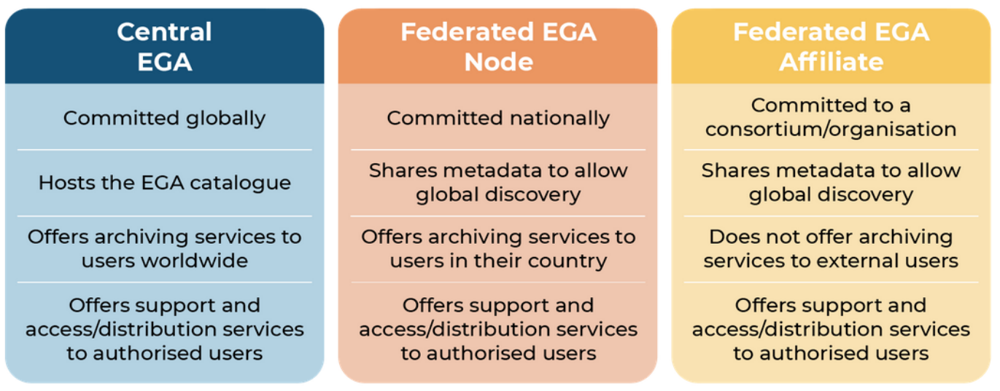
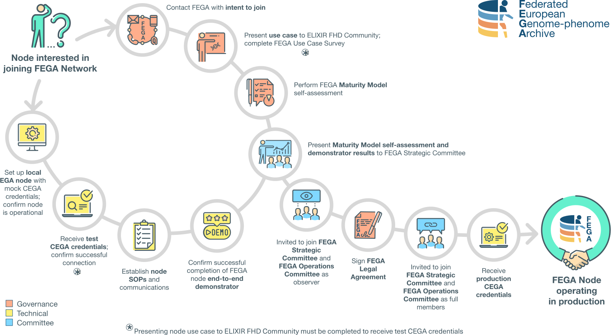

# Joining the Federated EGA Network

Welcome to this collection of onboarding materials for joining the Federated EGA Network!

## What am I doing here?

If you are reading this, you are probably looking for information on how to join the Federated EGA. Great! There is a lot of information here for you.

These materials provide guidance for joining the Federated EGA Network. The materials are based on the knowledge and experiences of current Nodes and their use cases. Your onboarding journey might differ depending on your use cases and mandates from stakeholders. Please view these materials as suggestions and best practices - not hard requirements!

## What is Federated EGA (FEGA)?

**Federated EGA is a global network of repositories enabling secure discovery and access to sensitive human data. Our vision is to accelerate scientific discovery and healthcare breakthroughs by creating the go-to worldwide sensitive human data resource.**

Our values are: 

*  **Privacy & Trust**: Ensuring privacy of data subjects, security of services and acting with integrity to build community trust.
    
*  **FAIRness**: Driving reuse of data through standardisation of metadata and clear access policies.
   
*  **Diversity**: Expanding our network and representing global diversity in the data we host to bring benefits worldwide.

## What are the benefits of joining Federated EGA?

* **Globally Accepted Standards**. Federated EGA develops and follows interoperable global standards for human data access accepted by the <a href="https://www.ga4gh.org/" target="_blank">Global Alliance for Genomics & Health (GA4GH)</a>. This commitment makes the whole service trustworthy for the most demanding data submitters, often concerned with data security and privacy.

* **Built with FAIR in mind**. Federated EGA is deeply commited to the <a href="https://www.go-fair.org/fair-principles/" target="_blank">FAIR principles</a>. By abbiding to FAIR you ensure that your data has the necessary Findability, Accessibility, Interoperability, and Reuseability to meet requirements of funders.

* **Enhanced Discoverability**. Your (meta)data will be available in a global catalog, maximizing its discoverability.

* **Aligned with most relevant data initiatives**. Many health data related projects are now under way, in particular the <a href="https://gdi.onemilliongenomes.eu/" target="_blank">Genomic Data Infrastructure (GDI)</a> and the <a href="https://www.european-health-data-space.com/" target="_blank">European Health Data Space (EHDS)</a>. These projects use FEGA like architectures for data storage and distribution, once again proving the quality of this design.
* **Network of Experts**. By joining Federated EGA, you will be part of a network of experts, making sure to stay up to date with the State-of-Art on Data Sharing.

## Summary of responsibilities

Summary of responsibilities of the Central EGA (EMBL-EBI & CRG), Federated EGA Nodes and Federated EGA Affiliates:

The onboarding materials below are designed for establishing a **Federated EGA Node**. We are in the process of incorporating **Affiliate** specific material, but until then please find more information about becoming a FEGA Affiliate in the following:
* [Introducing Federated EGA Affiliates: a newly defined tier in the Federated EGA Network](https://blog.ega-archive.org/fega-affiliates)

* [Everything you need to know about Federated EGA Affiliates: Q&A](https://blog.ega-archive.org/fega-affiliates-q&a)

* [FEGA Affiliate Collaboration Agreement](https://drive.google.com/file/d/18paT5cRVuSY9pGtLNp9A4Gjsi8HiHjEw/view?usp=sharing) (v1.0)

## How do I start?

The <a href="https://elixir-europe.org/communities/human-data" target="_blank">ELIXIR Federated Human Data (FHD) Community</a> provides a framework for the secure submission, archival, dissemination, and analysis of sensitive human data across Europe, and wider. All Federated EGA communications are currently sent through the ELIXIR FHD open channels. Welcome to join us!

1. **Join the <a href="https://elixir-europe.org/intranet/join-groups" target="_blank">ELIXIR FHD Mailing List</a>** (select "Human Data") to hear about the latest updates and events from the FHD community. You will need to log-in into the ELIXIR intranet.
1. **Attend the <a href="https://docs.google.com/document/d/1cNi2Dco97rGG31WIueUNjj8YBpOWYVkE2s_QPRXqy-0/edit?tab=t.0">ELIXIR FHD Community Calls</a>** to engage with the FEGA community. Meetings are the 1st Tuesday of the month @ 2pm CET/CEST.

Now that you are connected to the Federated Human Data community, you can learn more about Federated EGA specifically. **Read about the areas that interest you the most** (in no particular order):

* **[Governance and legal aspects](topics/governance-legal/)** of establishing a Federated EGA Node. Typically most useful for data protection officers, data stewards, policy makers, and strategic decision makers.

* **[Technical and operational aspects](topics/technical-operational/)** of establishing a Federated EGA Node. Typically  most useful for data protection officers, data stewards, policy makers, and strategic decision makers.

* **[Data and metadata management](topics/data-metadata-management/)** for establishing a Federated EGA Node. Typically most useful for bioinformaticians, data stewards, and support officers.

* **[Outreach and training aspects](topics/outreach-training/)** of establishing a Federated EGA Node. Typically most useful for data stewards, support officers, outreach/communications officers, and training organisers.

## What does the journey look like?

Displayed below are the steps a Node must take to become a full member of the Federated EGA Network. Based on experience, governance and legal development of a Node (red, top-right path) happens in parallel with technical and operational development (yellow, bottom left path) with one requirement: to receive test CEGA credentials, Nodes must first have presented their use case to the ELIXIR FHD Community.  Development converges when a Node is ready to present to the Federated EGA Strategic Committee and sign the Federated EGA Legal (Collaboration) Agreement.

.
  
The materials on this website guide you through onboarding information from the experiences of other Nodes. Explore the topics using the navigation panel on the left. Take what you find useful to apply to your own Node development.

You can use the <a href="https://inab.github.io/fega-mm/" target="_blank">Federated EGA Maturity Model</a> to plan and drive your own Node's development. The Maturity Model is divided into different domains, sub-domains, and maturity indicators which closely align with the topics outlined in these materials. You can [read more about how to interpret and use the FEGA Maturity Model](topics/maturity-model/).

There is no time limit on establishing a Federated EGA Node. Onboarding will take more or less time depending on existing infrastructure and governance models, availability of funding and resources, user needs, and other factors.

## License

The content of the FEGA onboarding materials and website are licensed under the <a href="https://creativecommons.org/licenses/by-sa/4.0/" target="_blank">Creative Commons Attribution Share Alike 4.0 International License</a>.

## Acknowledgements

We would like to thank all contributors, especially those mentioned in the <a href="https://github.com/EGA-archive/FEGA-onboarding/blob/main/CONTRIBUTORS.yaml" target="_blank">Contributors list</a>, the Federated EGA community for their support, and our funding partners.

Please see our <a href="https://github.com/EGA-archive/FEGA-onboarding/blob/main/CONTRIBUTING.md" target="_blank">contributing guide</a> for information on how to contribute to the generation and maintenance of these materials. Thank you in advance for your contributions!

 
  This website is part of a project that has received funding from the European Union’s Horizon 2020 research and innovation programme under grant agreement No 871075.
